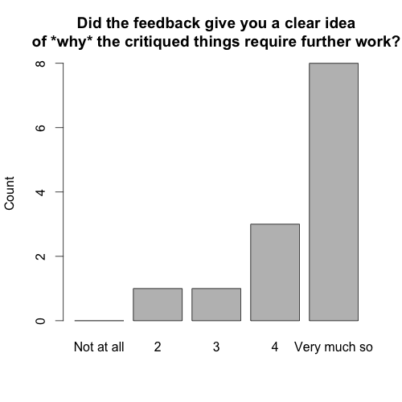

24\. srpna 2014 jsem vyvěsil odkaz na [svou nabídku poskytnutí zpětné vazby k esejům u přihlášek do UK a USA](http://simon.podhajsky.net/blog/feedback-k-esejum/ "Feedback k esejům"). (Nabídka stále platí! [Tady se dozvíte, jak na to.](http://simon.podhajsky.net/blog/feedback-k-esejum/ "Feedback k esejům")) Krom FB stránek Studuj v zahraničí a Fulbright Advising Center Czech Republic ji sdílelo alespoň jedenáct dalších lidí, za což jsem velmi vděčný. V rámci transparence zveřejňuji agregátní statistiku o tom, jak mou zpětnou vazbu studenti vyhodnotili.

(Všechny grafy jsem vyrobil ve vanilla R. Příště už nebudu líný a použiji ggplot, slibuji.)

**Vybrané pozitivní ohlasy**

- "It was an excellent feedback, probably the best one I have ever seen."
- "I have not expected such a thorough feedback."
- "Overall, the feedback was really helpful - there is nothing to improve IMHO :)"
- "I always like getting feedback from you, Simon! Thanks a lot!"
- "Your feedback was balanced and effective. Highlighting the parts in which you saw room for improvement and suggesting where they may be lacking was extremely helpful. At the same time, you managed to point out the paper's strengths, which was very encouraging"
- "Zatim super Simone, tesim se na dalsi spolupraci. Strasne moc si cenim toho, co delas!"

**<!--more-->**

**Nejčastější rady, které dávám**

[Opakující se rady jsem shrnul v odděleném článku.](http://simon.podhajsky.net/blog/2014/nejcastejsi-rady-k-commonapp-a-ucas-esejum/ "Nejčastější rady k CommonApp a UCAS esejům")

**V číslech**

Za poslední měsíc jsem poskytl devíti lidem zpětnou vazbu k 13 esejům. (Rozdíl je způsoben třemi druhými drafty a jedním třetím. Respektive, druhými a třetím drafty z mé perspektivy - je možné a pravděpodobné, že mezi mými feedbacky eseje prošly víc než jednou revizí.) Většina esejů byla personal statements pro UCAS.

Po každém kole zpětné vazby jsem si vyžádal zpětnou vazbu ke své zpětné vazbě. [Formulář](https://docs.google.com/forms/d/1B0vtaSlqYPc1CcX25PLWYREjhVEmFw_HCZvreebk6No/viewform) obsahuje krom (nepovinných) základních identifikačních údajů osm otázek na [Likertově škále](http://en.wikipedia.org/wiki/Likert_scale).

_**Obecná (a relativní) spokojenost s mou zpětnou vazbou**_

Co se spokojenosti týče, ptám se na dvě věci: je respondent obecně spokojený s mou zpětnou vazbou? A jak dobrá je má zpětná vazba ve srovnání s dalšími zdroji, které respondent pro svůj esej využil?

Za dobrou zprávu považuji to, že jsem ve většině případů nebyl první, kdo k danému draftu poskytnul zpětnou vazbu, a že má zpětná vazba není významně lepší než ta z jiných zdrojů. Je dobré vědět, že uchazeči o studium v zahraničí mají i další možnosti, jak získat kvalitní feedback.

(Celková v. relativní spokojenost má překvapivě nízkou, ač nenulovou korelaci - budu-li uvažovat kategorické datové body jako numerické, Pearsonovo r = 0.15.)

_**Jasnost zpětné vazby**_

Zpětná vazba je k ničemu, pokud její doporučení nejsou jasná, jasně opodstatněná, a poskytující jasné kroky ke zlepšení.

_**Chvála**_

Než přistoupím k datům: Jsem ohromen iniciativou, kterou studenti, kteří mají první draft svých esejů hotový několik měsíců před finálním termínem, ukazují. Bez jediné výjimky platí, že všechny eseje, které se mi dostaly pod ruku, bohatě naplňovaly základní požadavky.

Zároveň ale vím, že tohle vše občas nedávám dostatečně jasně najevo. Z mého soustředění na věci, které se v esejích dají dále zlepšit, si potom esejisté občas odnesou pocit, že všechno v jejich eseji je špatně. Není! Lepší způsob, jak mé komentáře vnímat, je jako **množství potenciálu, které ve vašem eseji vidím**. A potenciálu je ve všech vašich esejích habaděj.

_**Rychlost zpětné vazby**_

Včasnost je důležitá. Zatím se mi dařilo zpětnou vabu poskytnout nejpozději do týdne, většinou dříve; doufám, že toto tempo udržím i přes stupňující se množství mé školní i mimoškolní práce. (Respondent, pro kterého má zpětná vazba přišla téměř příliš pozdě, mi dodal svůj esej den před deadline. To, prosím, nedělejte.)

**_Stres_**

Snažím se držet stres způsobený mou zpětnou vazbou na minimu. Zatím se mi nepodařilo vysledovat, jaký druh zpětné vazby vede k minimalizaci stresu; jelikož nerandomizuji druh ani množství zpětné vazby, patrně se mi to v nejbližší době ani nepovede. Milí vystresovaní esejisté: není důvod se stresovat. Jste na dobré cestě.

**Závěrem**

This is fun! Posílejte další eseje!

Upozornění: Midterm exams a essay deadlines se mi kupí v týdnu před Oxbridge deadline. Pokud tedy máte o mou zpětnou vazbu zájem, snažte se mi prosím svůj esej poslat co nejdříve. Nula ve sloupečku "too late" na grafu včasnosti je dobrá pro všechny :)
