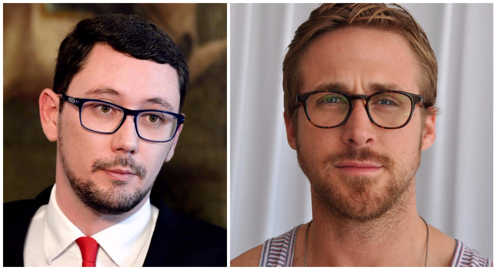
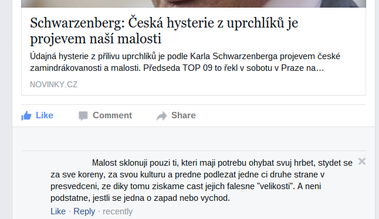

Předloňské vítězství Miloše Zemana přineslo do českých diskuzí čerstvé argumentační obraty. To, že je na nich něco v nepořádku, víte hned — ale díky kombinaci víceznačnosti a rozdílných předpokladů chvíli trvá, než přijdete na to, co. Je to lepší než sudoku.

Čestné uznání za mnohé z nových figur patří Jiřímu Ovčáčkovi. Ovčáček je Nick Naylor konzervativní levice: hoďte na něj cokoliv a než se nadějete, bráníte se proti vlastnímu nařčení. Jeho výstupy jsem dlouhodobě fascinován a pevně doufám, že ho bude v jeho biografii hrát Ryan Gosling.

 

 Ovčáček/Gosling, teenage heartthrobs

Následuje moje osobní hitparáda argumentačních obratů od ledna 2013.

### 1\. Oponovat Miloši Zemanovi, demokraticky zvolenému prezidentovi, je nedemokratické!

Přestože tato figura není z nejinventivnějších, vítězí díky své vytrvalosti na body. Kdykoli si už si myslíte, že jste se jí zbavili, vrátí se jako zmatená vlaštovka.

Typicky zní nějak takto.

> “Zemana lidé přímo zvolili a vy mu teď spíláte! To si říkáte demokrat?”

Ano. Protože demokracie není tyranie většiny. Protože si nevolíme diktátora na jedno funkční období. Protože kritika zvolených zástupců je klíčovou součástí demokracie. Protože prezidentem podepsané zákony musím dodržovat, nikoliv schvalovat.

Lidé, kteří se necítí být Milošem Zemanem adekvátně reprezentováni, někdy říkají, že Zeman není jejich prezident. To je hyperbola, ne puč. Na puč by museli začít porušovat Zemanem podepsané zákony nebo chystat protizemanovskou revoluci.

Ale to už by si neříkali demokrati.

### 2\. Kritika Miloše Zemana mu upírá svobodu slova!

22\. října poukázal komisař OSN pro lidská práva [mj. na to, že výroky Miloše Zemana jsou xenofobní a islamofobní](http://www.un.org/apps/news/story.asp?NewsID=52337). (Mohl by říci i poplašné a zavádějící.) Nechme stranou, že čeští politici kritiku zamítli standardním tu quoque (“vy zase v Jordánsku porušujete jiná práva”) -- to už je klasika. Z vyjádření Jiřího Ovčáčka se ale člověku rázem zatočí hlava.

> “Jedním z nejdůležitějších výdobytků listopadových událostí v roce 1989 je podle mého názoru svoboda slova a svoboda názorů. Taková prohlášení jsou proti tomuto duchu.”

Kritika Zemanova veřejného vyjádření, ať je jakákoliv, nijak neomezuje Zemanovu svobodu slova. To platí i tehdy, [kdyby Zemanova vyjádření nebyla v rozporu se zbytkem Všeobecné deklarace lidských práv](http://nazory.aktualne.cz/komentare/cesko-smrdi-od-zemana-osn-nas-tvrde-kritizuje-za-xenofobii-a/r~06c5df52796511e58f1e002590604f2e/). Zeman si nadále může říkat, co chce. Jediné, co OSN může udělat, je upozorňovat na rozpor s hodnotami, které [Česká republika zakotvila ve svém ústavním řádu](https://cs.wikipedia.org/wiki/Listina_z%C3%A1kladn%C3%ADch_pr%C3%A1v_a_svobod).

Není ale elegantní, jak Jiří Ovčáček stihl ve dvou větách obrátit obvinění z porušování lidských práv proti jeho původci? A k tomu ještě lehce nadhozená analogie mezi OSN a předlistopadovou totalitou! Ten muž je génius.

### 3\. Kritika Miloše Zemana narušuje státní suverenitu!

Kritika OSN nechala vzniknout i této perle z druhé části Ovčáčkova vyjádření:

> “Kaceřovat takovým způsobem suverénní zemi je zcela nemístné.”

Nechme stranou to, že kritika OSN nemá žádný dopad na výkon české státní suverenity. Důležitější je, že jednou z funkcí OSN samozřejmě _je_ kaceřovat suverénní země, které porušují vlastní závazky vůči lidským právům. Ohrazovat se vůči této funkci OSN je v momentě, kdy [Miloš Zeman vyzývá Radu bezpečnosti k vojenské intervenci na cizím území](http://zahranicni.eurozpravy.cz/amerika/132838-zeman-proti-terorismu-navrhuji-akci-pod-zastitou-rady-bezpecnosti-osn/), přinejmenším humorné.

Ale jako signál národovcům dobrý.

### 4\. Malost není odmítnout morální závazek, malost je sklonit se před ním!

Za tenhle Jiří Ovčáček nemůže, přestože by se za něj nemusel stydět.

> "Malost skloňují pouze ti, kteří mají potřebu ohýbat svůj hřbet, stydět se za své kořeny, za svou kulturu a předně podlézat jedné či druhé straně v přesvědčení, že díky tomu získáme část jejich falešné "velikosti". A není podstatné, jestli se jedná o západ nebo východ.

Tahle figura je vlastně docela fikaná: ztotožňuje _malost_ a _slabost_. Kdo by ostatně nesouhlasil s tím, že veliký národ nedělá věci z donucení, že? Proč bychom měli poslouchat kohokoli jiného?

Klíčový problém této ekvivokace je vypuštění jakýchkoli morálních hodnot. Hlavní je, aby Češi dělali, co si usmyslí; jediný indikátor velikosti je přece to, že si do toho nenechají mluvit od lidí bez českého pasu.

Veliký národ se před morálním imperativem skloní rád; nikdo ho tím nemusí úkolovat. Diktát Milla a Kanta není britsko-německým imperialismem.

### 5\. Zveřejnění dotazů pro Miloše Zemana = komunistické úkolování tisku!

Miloš Zeman je oblíbeným cílem Jakuba Jandy; Jakub Janda je zase oblíbeným cílem Jiřího Ovčáčka. Jejich hašteření sice nevydá na nový Comeback, ale minisérie by z toho vyjít mohla.

Jakub Janda na konci srpna zveřejnil v Respektu [sedm dotazů](http://www.respekt.cz/externi-hlasy/kdy-milos-zeman-odvola-nepravdu-z-cinske-televize), na které by od Zemana chtěl slyšet odpovědi. Zeman se totiž zavázal, že na nadcházející tiskové konferenci zodpoví všechny položené otázky.

[Reakci Jiřího Ovčáčka shrnuje Echo24.cz](http://echo24.cz/a/izqKX/ovcacek-napadl-iniciativu-jako-oddeleni-ksc-odmita-otazky-na-zemana). K nejzajímavější figuře došel až na konci:

> “Think-tank Evropské „hodnoty“ rozeslal v rámci pokračující antizemanovské akce hromadně médiím „Sedm otázek“, které si „dovoluje doporučit“ pro pondělní tiskovou konferenci. Zdá se, že nám zde vyrůstá nové Oddělení masových a sdělovacích prostředků ÚV KSČ. Po „Fakta nelze zamlčet“ přichází „Pokyn pro sdělovací prostředky č. 1-2015“. Gratuluji.”

Je mi skoro hloupé Ovčáčkův výrok rozebírat — zarazilo mě už to, že jej vypustil z klávesnice. Kde vůbec začít? Zveřejňovat otázky pro politiky není nezvyklé — [Politico](http://www.politico.com/magazine/story/2015/10/the-almost-inevitable-first-year-crisis-213294) a [Huffington Post](http://www.huffingtonpost.com/christopher-lamb/ask-these-questions-to-th_b_8392724.html) tak učinily jen v posledním týdnu. Jandovy otázky nebyly závazné a jejich položení nijak nevynucuje, i kdyby měl jak. Co víc, Jandovy otázky novináře nikterak neomezují; svoboda tisku je zaručena.

Tato figura nemá Ovčáčkovu obvyklou eleganci; je jen nezvykle absurdní. Obsazuje proto ubohé páté místo.

---

Tato hitparáda je nekompletní. Je také nepodstatná: zahrnuje především věci, které jsou absurdní, ale v zásadě na nich nesejde. Nakažlivé polopravdy a amorální argumentační východiska, která Miloš Zeman v českém veřejném prostoru pomáhá normalizovat, jsou mnohem závažnější.

Na jejich hitparádu ale nemám žaludek.
