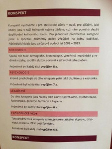

Přijímací řízení na anglicky mluvící univerzity je za námi. (Až na výjimky, mezi které patří např. Nizozemsko - pokud jste zaváhali, pořád ještě máte šanci!) Je tedy čas bilancovat; dojde na slova i na data. Začnu daty.

# Data

**68 revizí, 45 esejů, 30 esejistů a 42 hodnocení mé zpětné vazby.** Revizí mohlo být kulatých 70, ale bohužel jsem se k jedné revizi a jedné kompletní magisterské přihlášce nedostal. (Omlouvám se.)

Statistiky hodnocení jsou důležité hlavně pro mě, ale protože si rád hraju s R a chtěl jsem se procvičit s ggplotem, sdílím i grafy.

# Slova

**Stálo to za to?** Mně určitě; myslím, že i esejistům. Je sice ještě brzy, ale už teď vím, že se jeden z nich dostal na UChicago s plnou finanční pomocí, tři na Oxford a jeden na LSE. Úspěch je jen jejich, ale mám radost, že jsem je mohl trošku postrčit.

**Poznatky a časté problémy?** O některých už jsem napsal v článku [Nejčastější rady k CommonApp a UCAS esejům](http://simon.podhajsky.net/blog/2014/nejcastejsi-rady-k-commonapp-a-ucas-esejum/ "Nejčastější rady k CommonApp a UCAS esejům"). Tady jsou další čtyři:

**_1\. "Zajímám se o_ (doplň společenskou vědu)_, protože jsem sledoval postkomunistickou přeměnu Česka."_** Ze společenskovědních personal statementů jich takto začínala významná menšina. To není nutně problém, ale konkrétní detaily, které je zaujaly, přidá jen málokdo. (Related: Pokud byste mohli cestovat do libovolného momentu v čase, kam by to bylo? K pádu berlínské zdi? Vy taky?)

_**2\. Klasifikace předmětů**._ Sociologie, psychologie i antropologie jsou společenské vědy, ne humanities; ekonomie je taky společenská věda a to, že používá víc matematiky, neznamená, že je automaticky rigoróznější. Všechny společenské vědy používají kvantitativní i kvalitativní metody; všechny se zabývají složitými nevyřešenými otázkami; žádná nespočívá v tom, že budete rok poslouchat přednášky a pak o problematice vědět vše, co je lidsky možné vědět; a žádná není "kecárna", kterou se problablá každý.

_**3\. Kritická reflexe**._ Postuluji čtyři úrovně psaní o něčem, co jsem četl. První je zmínka názvu/autora; druhá je name-drop názvu/autora s obecným popisem; třetí je vysvětlení hlavního argumentu; čtvrtá je popis limitů hlavního argumentu a kontrast s dalšími zdroji evidence. Vyjádření entuziasmu není náhražkou kritické reflexe.

_**4\. Co učí psychologie**._ Tohle bude na samostatný článek, ale v krátkosti: dnešní akademická psychologie je kognitivní psychologie. Psychologie vám zřídka pomůže pochopit, co si ostatní myslí; opatrnost je na místě, protože alternativou je v lepším případě [temná racionalistická magie](http://lesswrong.com/lw/he/knowing_about_biases_can_hurt_people/) a v horším případě [medikalizace chování, která se vám nezamlouvají](http://the-toast.net/2013/12/04/your-ex-might-not-have-a-personality-disorder/). Psychologie není jen klinická psychiatrie.

Co psychologové? Jung a Freud jsou out; bereme si od nich, že podvědomí (tj. automatické procesy) je důležité, a necháváme jim neverifikovatelné či vyvrácené hypotézy typu kolektivního nevědomí a análních fixací. Piaget je fajn, ale nezapomeňte se podívat na současnou vývojovou psychologii (viz Bloom či Spelke). Self-help knížky v lepším případě selektivně vyzobávají validní závěry psychologických výzkumů, v horším propagují totální mýty (Law of Attraction, I'm looking at you). Jestli se chcete dostat blíž k tomu, co vás na psychologii budou opravdu učit, zkuste Pinkera nebo Kahnemana; nebo se zapište na kurz na Courseře ([Introduction to Psychology](https://www.coursera.org/course/intropsych) a [A Beginner's Guide to Irrational Behavior](http://www.coursetalk.com/coursera/a-beginners-guide-to-irrational-behavior?search_index=1) jsou dvě velmi dobré volby). Všechny personal statementy na psychologii, které mi přišly, se s těmito problémy do jisté míry setkávaly.

Nevím, co za to může. Vysoké zastoupení "psychologů" v "poradnách" "magazínů"? Mizerné pokrytí psychologie v rámci základů společenských věd na gymnáziích? Knihovny házející psychologii a okult na jednu hromadu?

\[caption id="attachment_205" align="aligncenter" width="225"\] Kam zařazuje ostravská knihovna psychologii (via Petr Paleček)\[/caption\]

**Co dál?** Tento rok určitě plánuji pokračovat. V mezičase napíšu pár článků o tom, co jsem se za poslední čtvrtrok naučil.
