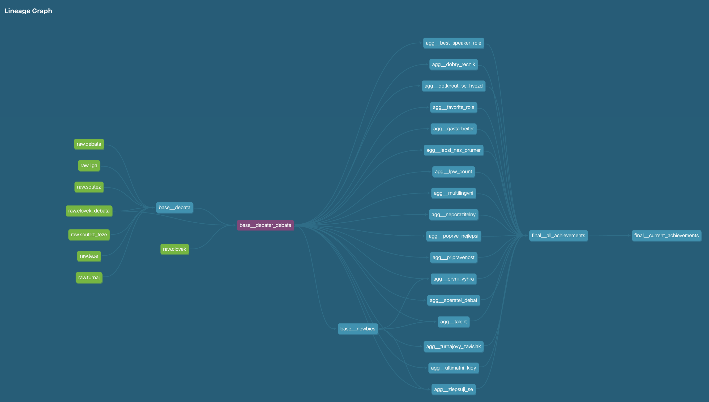

We recently released the Year 2 version of **greybox Wrapped**, a Spotify Wrapped clone for high school debaters. [Last year, I talked about the way ChatGPT helped me write frontend and deploy it](https://www.linkedin.com/pulse/chatgpt-makes-side-projects-easy-case-study-simon-podhajsky). This year, I want to talk about the way we used dbt to structure the central database, and how it helped us collaborate on the project.

[The entire repository - with a very readable README, I should add - is available on Github.](https://github.com/PiechZ/greybox_wrapped)

## At the beginning, there was a MySQL production database

Czech high school debate stores its records in a system called Greybox (written by [the inimitable Petr Novák](https://www.linkedin.com/in/9bcfd/) at the turn of the millenium, and working just fine to this day). The database is a MySQL database with a few dozen tables, and it stores information about tournaments, debate rounds, speakers, teams, and more.

This means that the central task of **greybox Wrapped** was transforming this database - twice, actually: once to get the data into a format that would be easy to aggregate into individual achievements, and another time to actually make the achievements. Tell me if this doesn't sound like a job for dbt!

(Of course, while dbt was the central piece of the puzzle, it was not the only one. To pull the data transformation pipeline off, we used [Meltano](https://docs.meltano.com) to convert MySQL to DuckDB, then run the dbt transformations, and save the results into another DuckDB file that we then deployed alongside the backend. But this write-up is about dbt and the data modelling that it enabled.)

## The layers of data modelling

In accordance with dbt best practices, [we structured the data modelling into several layers](https://docs.getdbt.com/best-practices/how-we-structure/1-guide-overview), each with a different granularity and purpose. Given the specific needs of our project, we deviate a bit from the standard dbt setup of staging/intermediate/mart layers, but the principles remain similar.



### Base layer: clear models with clear granularity

There's many relationships in a debate tournament, and this is not a statement on the interpersonal dynamics of debaters. There's a tournament, which has rounds, which have teams, which have speakers, which have achievements. There's also a lot of metadata about each of these entities, like the school a speaker is from, or whether the motion the round is debated on is a prepared one.

So what's the right granularity? In other words, what does each row in a given table refer to?

The right granularity often depends on the intended use case. Here, we quickly realized that we wanted to focus on individual debaters' achievements, which meant that we wanted to zoom in on the level of _each speech within each debate_, with team-level, debate-level and tournament-level details modelled separately and joined onto the speeches table.

### Intermediate layer: Common pre-aggregations

You'd think we'd be almost ready for the achievements, and you'd almost be right - except that some achievements re-used the same aggregations (for example, we created separate achievements for folks with a speaker average 75 and 80, and between 80 and 85, but the logic to derive the annual speech average was the same across both).

This layer actually came _last_ in our dbt project, because we only realized we needed it after we had already started writing the achievements. But it was a good thing we did, because it allowed us to keep the achievements themselves clean and focused on the logic that was unique to each of them.

### Aggregation layer: Achievements, finally

We started with granularity once more: this time, one achievement award per row, with unique achievement ID to filter out duplicates. Then, each model was a separate achievement, with all the complicated window logic and filtering required for each one. (As a fun consequence, this approach computed all achievements _across the entire lifetime of the debate database_, which means that we have a historical benchmark for the rarity of some of them.)

### Final layer: Union all the things

The "final" layer was actually an export layer, because we unioned all the achievements into a single table _and materialized them into a [separately-attached DuckDB file](https://duckdb.org/docs/sql/statements/attach.html)_. (This is a neat trick that's possible as of DuckDB 0.7.0.) Grabbing the data is then a simple matter of running a `SELECT * FROM current_achievements WHERE user_id = ?` query[^1].

The separately-attached file was then deployed (read: SFTP'd) alongside the backend, which the frontend would query to get the achievements for each user.

## Collaboration and tests

I intentionally structured the project like this in order to make it easy for relative newcomers to dbt/SQL to contribute. [YAML anchoring](https://support.atlassian.com/bitbucket-cloud/docs/yaml-anchors/) made it easy to extend previously defined column definitions and tests to the new aggregation logic, making sure that the new achievements didn't violate any assumptions the backend would be making about the data.

```yaml
models:
  # Sample definition of an achievement, using agg__
  # as prefix because it's always an aggregation
  - name: agg__overruled
    description: >
      Judges overruled by a panel of other judges.
    # Create the reference with the &ANCHOR, e.g.:
    columns: &STANDARD_ACHIEVEMENT_COLUMNS
      - name: clovek_id
        tests:
          - not_null
      - name: school_year
        tests:
          - not_null
      - name: achievement_id
        tests:
          - unique
          - not_null
      # ...potentially more columns
  - name: agg__gastarbeiter
    description: >
      Debaters who shared a team with a debater
      from another club/school.
    # Use the reference here as *ANCHOR
    columns: *STANDARD_ACHIEVEMENT_COLUMNS
    # The `columns` node now includes the three
    # columns from above + the associated tests!
```

This ended up catching a fair amount of errors, and I'm glad we did it. We later ended up codifying the dbt-build presumption into a [dbt-checkpoint](https://github.com/dbt-checkpoint/dbt-checkpoint) pre-commit hook that ran everytime we altered the code in the dbt section of the monorepo.

### Note on development velocity

The ideal dbt workflow is a fast iteration on a single model. This is _not_ what we did, at least not by default: instead, we containerized the dbt project and ran the entire pipeline every time we wanted to test a change. This was slow, but it was also safe, and it allowed us to catch errors early.

We did eventually find a way to configure a local, non-Docker way to run dbt with [Power User for dbt Core](https://marketplace.visualstudio.com/items?itemName=innoverio.vscode-dbt-power-user); this required different pathing and environment variables.

## Secondary use: analytics

One useful side-effect of putting dbt/DuckDB at the center of everything is that at the end, we're left with an easy-to-share, easy-to-query OLAP database that we can use for analytics. This ended up being a great introduction to SQL and databases for some of our quantitatively-minded alumni, so I'm even gladder we did it.

(One of my favorite features of dbt is [the `persist_docs` setting](https://docs.getdbt.com/reference/resource-configs/persist_docs), which I typically set for everything I can:

```yaml
# dbt_project.yml
models:
  +persist_docs:
    relation: true
    columns: true
```

This writes the documentation for each model and column into the DuckDB database, which means that it travels with the DuckDB file and is available upon `DESCRIBE` or attachment to DBeaver.)

## Conclusion

Sure, FastAPI and React get all the glory, but dbt and DuckDB were the unsung heroes of this project. This is technically doable for any project that deals with a lot of upfront data that has to be transformed and is then presented; in theory, [one could even do edge computation with DuckDB in the browser via WASM](https://duckdb.org/2021/10/29/duckdb-wasm.html). I can only recommend it.

[^1]: What about the rest of the project? Or, in the immortal words of the meme, how do you draw the rest of the owl?  That's a matter for separate articles, but I do think [the repository README](https://github.com/PiechZ/greybox_wrapped) is a good place to start.

