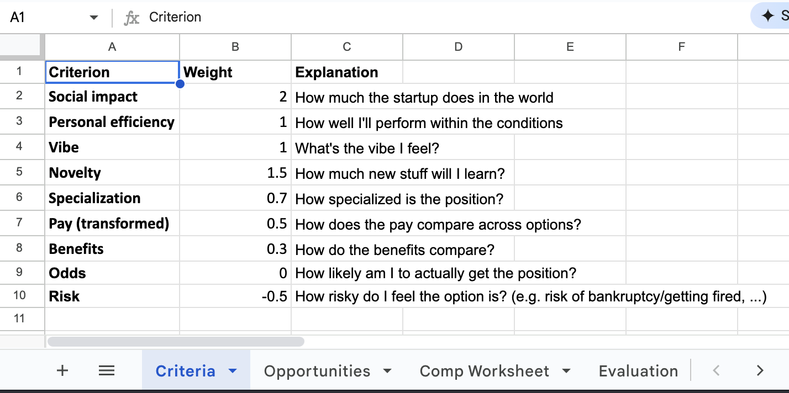
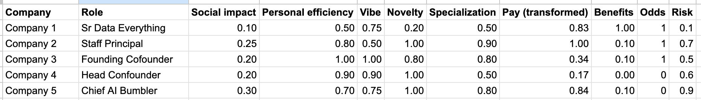
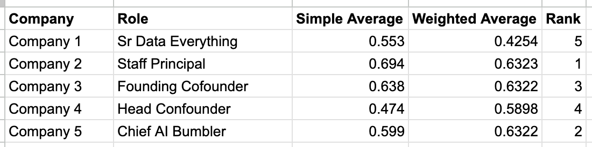

A long time ago, [Katarína](https://www.linkedin.com/in/katarina-r-3840401b8) sent me a paper by Robyn M. Dawes called **[The Robust Beauty of Improper Linear Models in Decision Making](https://www.cmu.edu/dietrich/sds/docs/dawes/the-robust-beauty-of-improper-linear-models-in-decision-making.pdf)**. It was my first introduction to the idea that using highly simplified models can still outperform intuition in decision-making.

In the past five years, I've been using this idea to assist me in making decisions. The task isn't always to overrule intuition, but rather to (1) make sure I'm not missing any important factors, and (2) ensure my intuition is not being misled by irrelevant factors. In the last round of job decisions, I've finally become happy enough with my approach that I'm writing this blog post to share it.

I'm attaching a screenshot of the multi-sheet spreadsheet I've been using. Below, I'll walk you through the different sheets and how they work together. Overall, I'd say that there are five steps to creating a decision matrix:

1. The Criteria
2. The Weights
3. The Opportunities
4. The Ratings
5. The Results

## The Criteria

The first sheet contains your criteria. A criterion is just a factor that you're considering in your decision. List all of them, one per row.

**How can you avoid too many criteria?** When I've run into this problem, I've typically grouped similar criteria into a single one and increased its weight (see below). For instance, "friendliness" and "team spirit" are similar, so I've grouped them under "vibe".

## The Weights

Still on the first sheet, you should apply a weight to each criterion. This is how important each criterion is to your decision.

**The sum of all weights does not need to be 1.** We'll normalize them later. For now, focus on getting the relative weights right.

**Some weights can be negative.** This is useful if you want to penalize a criterion. For instance, if you're deciding between two jobs, you might want to penalize the one that requires a move, or one that involves more risk.

**What if I want to track a statistic without involving it in the decision?** Either use a helper sheet to track it, or include it in the criteria sheet with a weight of `0`.

## The Opportunities

The second sheet contains your opportunities. An opportunity is a specific situation that you're considering. List all of them, one per row. I typically list them in two columns: "Company Name" and "Position Name", since I typically consider each company-position pair separately.

_Names and titles were redacted, but Chief AI Bumbler does have a nice ring to it._

## The Ratings

Still on the second sheet, transpose the criteria as column headers, with opportunities as row headers. Now, rate each opportunity on each criterion, **from 0 to 1**.

**But Simon, how can I know if the vibe of a company is exactly 0.57?** Honestly, you can't. Using "vibe" as an example, your best guess should look like this:

1. What does the best possible vibe (= `1.0`) look like?
2. What does the worst possible vibe (= `0.0`) look like?
3. How does the vibe of this opportunity compare to the best and worst?
4. How does the vibe of this opportunity compare to the vibe of the other opportunities? If the other opportunity is `0.25` and this feels like `0.5`, is it twice as good?

**How do I compare items that don't fall on the 0-1 scale - for instance, salary?** Use a linear transform on a helper sheet. For instance, say that your minimum is `50,000` and your maximum is `500,000`. Now, you can use the formula `=(salary - 50000) / (500000 - 50000)` to get a number between `0` and `1`.

**Speaking of salary, how do I involve equity and benefits?** Try standardizing and use your best guess as the Net Present Value! This is beyond the scope of this blog post, but one simple approach would estimate the overall value of the equity and the likelihood of receiving it / converting it into cash, and then calculate the expected value by multiplying the two.

## The Results

The last sheet contains the results. It's a simple table that shows the weighted average of the ratings for each opportunity - the weight being provided, of course, by the criteria sheet - and normalized to a 0-1 scale. At this point, you have several options:

1. You can just look at the results and make your decision.
2. You can check the results against your intuition, and adjust the opportunity ratings or the weights accordingly.
3. You can identify what drags down the score of an opportunity, and use that as a guide to improve it.

**What if the opportunities come out the same? How can you possibly decide based on a one-ten-thousandth of a point?** This is a good problem to have! You can now focus on the criteria that differentiate them, and possibly re-visit their weights.  

## Conclusion

I love this approach to decision-making. It's a good way to integrate multiple dimensions without going insane with pro-con lists. It's also a fun way of making people's eyes glaze over. (Just kidding, all my friends love spreadsheets.)